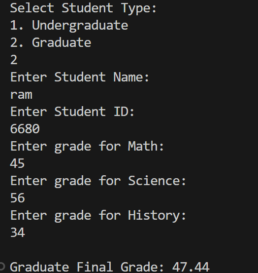
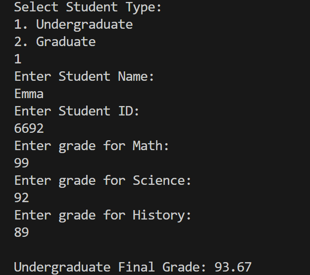

# Student Grading System


## Description

The Student Grading System is a Java-based application designed to manage and calculate student grades efficiently. This system allows educators to input student scores, calculates final grades, and generates comprehensive reports for each student.

## Features

- **Easy Grade Entry:** Simplified input of student scores.
- **Automated Calculations:** Automatic calculation of final grades based on predefined criteria.
- **Report Generation:** Generate detailed grade reports for individual students.
- **User-Friendly Interface:** Intuitive and easy-to-use interface for educators.

## Installation

To get a local copy up and running follow these simple steps.

### Prerequisites

- Java Development Kit (JDK) installed on your machine.
- IDE (e.g., IntelliJ IDEA, Eclipse, NetBeans) for Java development.

### Installation Steps

1. **Clone the repository:**
   ```sh
   git clone https://github.com/22h51a6680/Student-Grading-System.git
   ```
2. **Navigate to the project directory:**
   ```sh
   cd Student-Grading-System
   ```
3. **Open the project in your preferred IDE.**

4. **Build the project and resolve dependencies.**

## Usage

1. **Run the application from your IDE.**
2. **Follow the on-screen instructions to input student scores and generate grade reports.**

## Contributing

Contributions are what make the open-source community such an amazing place to learn, inspire, and create. Any contributions you make are **greatly appreciated**.

1. **Fork the Project**
2. **Create your Feature Branch (`git checkout -b feature/AmazingFeature`)**
3. **Commit your Changes (`git commit -m 'Add some AmazingFeature'`)**
4. **Push to the Branch (`git push origin feature/AmazingFeature`)**
5. **Open a Pull Request**

## License

Distributed under the MIT License. See `LICENSE` for more information.

## Output

## For Input 1

## For Input 2 


